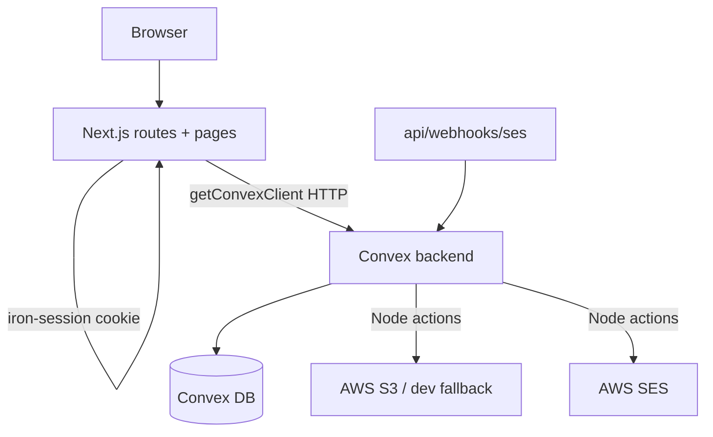

# Convex Migration MVP Cutover

Scope confirmed: keep core auth (all roles), basic seller KYC + document upload, and admin KYC approval. Cut advanced admin user management. Delete all tests. Convex deployment is local-only (you'll set up prod yourself).

## Target architecture

Auth stays hybrid: iron-session cookie carries `userId`+`role`; all data lives in Convex. No Prisma, no Postgres.

## 1. Add missing Convex functions

New files under `convex/`:

- `convex/kyc/queries.ts`: `getSellerKycState(userId)` (profile + documents + bank account + computed wizard step), `getKycDocumentRef(userId, docId)` (returns `s3Key` for presign).
- `convex/kyc/mutations.ts`: `updateSellerEntity`, `createKycDocument`, `createBankAccount` (create + link `bankAccountId` on profile), `submitKyc` (validate entity/doc/bank, set `kycStatus=PENDING`). Port the guard logic (block edits when `PENDING/APPROVED`) from the current routes.
- `convex/admin/kyc.ts`: `listPendingKyc` (query: pending sellers + doc counts), `getKycDetail(userId)` (query), `approveKyc(userId, reviewerId)` (mutation: set profile `APPROVED` + docs `APPROVED`), `rejectKyc(userId, reviewerId, notes)` (mutation).
- `convex/seed.ts` (`"use node"` action `seedAdminAction`): hash password with argon2 and insert an `ADMIN` user (`status=ACTIVE`, `emailVerified=true`) via an internal mutation. Run with `npx convex run seed:seedAdminAction '{"email":"admin@ccverse.local","password":"..."}'`.

Then run `npx convex codegen` so `@/convex/_generated/api` picks up the new functions.

## 2. Rewrite seller-KYC routes to Convex

Rewrite these (they currently don't compile) to call the new Convex functions via `getConvexClient()`, with correct imports:

- [app/api/seller/kyc/route.ts](app/api/seller/kyc/route.ts) - GET/PATCH via `getSellerKycState` / `updateSellerEntity`
- [app/api/seller/kyc/documents/route.ts](app/api/seller/kyc/documents/route.ts) - keep multipart parse + SHA256 + `putObjectAction`, then `createKycDocument`
- [app/api/seller/kyc/bank-account/route.ts](app/api/seller/kyc/bank-account/route.ts) - `createBankAccount`
- [app/api/seller/kyc/submit/route.ts](app/api/seller/kyc/submit/route.ts) - `submitKyc` + existing `sendKycSubmittedEmailAction`

## 3. Rewrite admin-KYC routes to Convex

- [app/api/admin/kyc/route.ts](app/api/admin/kyc/route.ts) - `listPendingKyc`
- [app/api/admin/kyc/[userId]/route.ts](app/api/admin/kyc/[userId]/route.ts) - `getKycDetail`
- [app/api/admin/kyc/[userId]/approve/route.ts](app/api/admin/kyc/[userId]/approve/route.ts) - `approveKyc` + `sendKycApprovedEmailAction`
- [app/api/admin/kyc/[userId]/reject/route.ts](app/api/admin/kyc/[userId]/reject/route.ts) - `rejectKyc` + `sendKycRejectedEmailAction`
- [app/api/admin/kyc/[userId]/documents/[docId]/url/route.ts](app/api/admin/kyc/[userId]/documents/[docId]/url/route.ts) - fix the broken syntax/missing imports; use `getKycDocumentRef` + existing `presignGetAction`

## 4. Port remaining Prisma consumers

- [lib/rbac/seller.ts](lib/rbac/seller.ts) - `requireKycApproved` reads seller `kycStatus` from a Convex query instead of `prisma.sellerProfile`.
- [app/(seller)/seller/page.tsx](<app/(seller)/seller/page.tsx>) - server component: replace `prisma` read with `getConvexClient()` + `getSellerKycState`.

## 5. Auto-activate users on register (MVP shortcut)

In [convex/auth/mutations.ts](convex/auth/mutations.ts), set `createBuyerMutation` / `createSellerMutation` to `status: "ACTIVE"`, `emailVerified: true` so login works without a working SES/verification link. The `/verify-email/[token]` route/page stay but become optional. (Default choice; email verification can be re-enabled post-launch.)

## 6. Delete cut features (advanced admin user management)

Delete routes + pages, then remove any `<Link href="/admin/users...">` (typedRoutes will fail the build otherwise, e.g. in [app/(admin)/admin/page.tsx](<app/(admin)/admin/page.tsx>) and admin nav):

- `app/api/admin/users/route.ts`, `app/api/admin/users/[id]/route.ts`, `.../ban/route.ts`, `.../suspend/route.ts`
- `app/(admin)/admin/users/page.tsx`, `.../[id]/page.tsx`, `.../new-staff/page.tsx`

## 7. Remove Prisma / Postgres

- Delete `prisma/` (schema, `migrations/`, `seed.ts`), `lib/db/`, `lib/audit/`, `lib/storage/`, and unused `lib/email/` server drivers (superseded by `convex/email` + `convex/storage`).
- Delete Prisma-coupled job runner: `jobs/runner.ts`, `jobs/registry.ts`, `jobs/scheduler.ts`, `jobs/index.ts`. Keep `jobs/logger.ts` (used by [app/api/webhooks/ses/route.ts](app/api/webhooks/ses/route.ts)).
- `package.json`: remove deps `@prisma/client`, `prisma`; remove `postinstall` (prisma generate), all `db:*` scripts, and the `prisma.seed` block.
- `.env.example`: remove `DATABASE_URL`, add `NEXT_PUBLIC_CONVEX_URL`. (`lib/env.ts` already dropped `DATABASE_URL` in the working tree.)
- `infra/docker-compose.yml`: remove the Postgres service + volume (MinIO optional; Convex storage has a dev fallback).

## 8. Delete all tests

- Delete `tests/` (all unit + e2e), `vitest.config.ts`, `playwright.config.ts`.
- `package.json`: remove `test`, `test:watch`, `test:coverage`, `test:e2e`, `test:e2e:install` scripts; remove devDeps `vitest`, `@vitest/coverage-v8`, `@playwright/test`, `aws-sdk-client-mock`.
- [.github/workflows/ci.yml](.github/workflows/ci.yml): remove the "Unit tests" step. Keep lint, typecheck (+ `convex codegen`), format:check, build.

## 9. Verify green

- `npx convex codegen`
- `npm run typecheck && npm run lint && npm run build` - fix any residual references.
- `npm run format` to satisfy `format:check`.
- Optional: `npx convex dev` to push schema/functions locally and smoke-test register -> login -> seller KYC submit -> admin approve.

## Notes / risks

- Convex prod deployment + `NEXT_PUBLIC_CONVEX_URL` are yours to set before release; the app will not function without a reachable Convex URL at runtime.
- After removing Prisma, the admin account only exists once you run `seedAdminAction` against the target deployment.
- `CLAUDE.md`/`docs/plan.md` still describe the Prisma stack; updating them is deferred (not build-blocking).
